# PENT HOUSE
> 공공데이터 기반 아파트/연립다세대 실거래가를 검색할 수 있는 웹서비스 PENT HOUSE를 소개합니다. 
> 
> Spring Boot와 Vue.js를 이용하였으며 **RESTful**기반으로 **SPA**를 구현하였습니다.
> 
> 개발 기간 : 약 10일
> 
> 개발 인원 : 2명
> 
> 사용 기술 : Spring Boot / Vue.js /Node.js / MyBatis / Google Maps API / BootStrap
 - [Intro](#intro)
 - [Main](#main)
 - [Join / Login](#login)
 - [Search](#search)
 - [Notice](#notice)
 - [News](#news)
 - [Review](#review)

## Intro

사용 기술

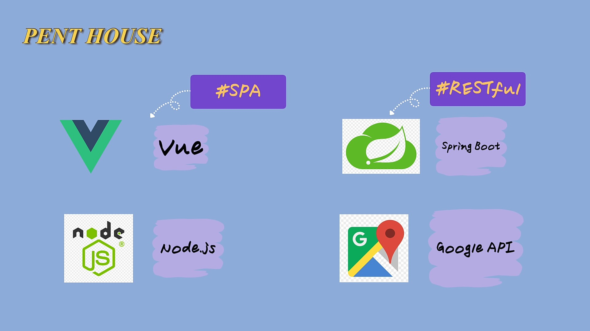

역할 분담 - 기본적인 프론트는 같이 개발하고 이후 기능별로 나눠서 개발 진행하였습니다.

## Main
메인 화면

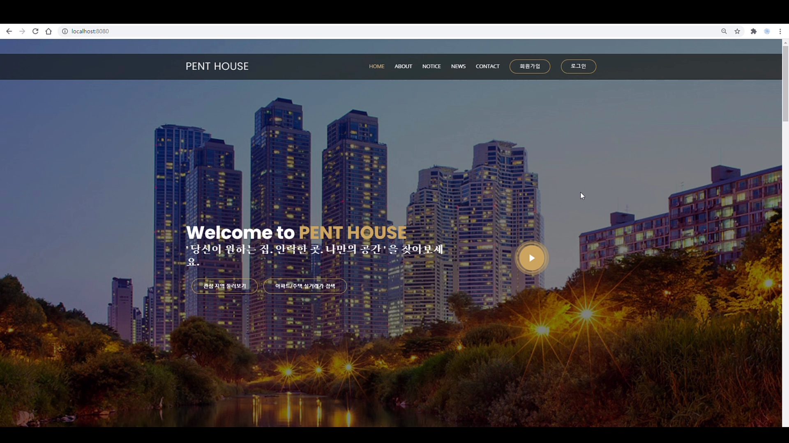

페이지 소개

## Join / Login
회원 가입

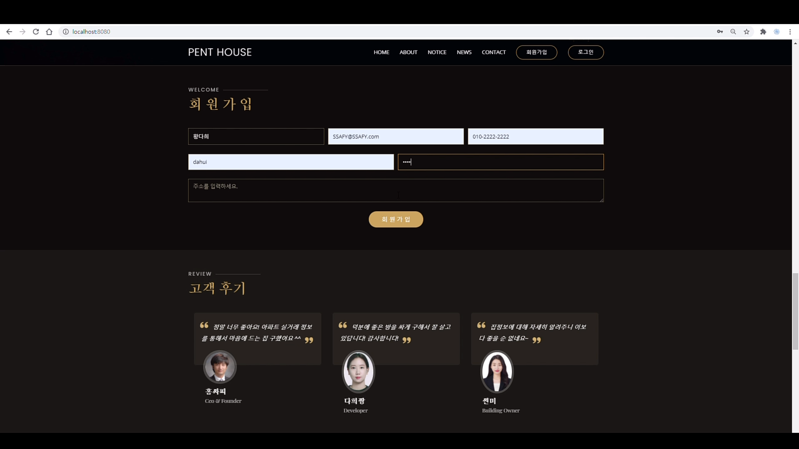

로그인 실패 검증

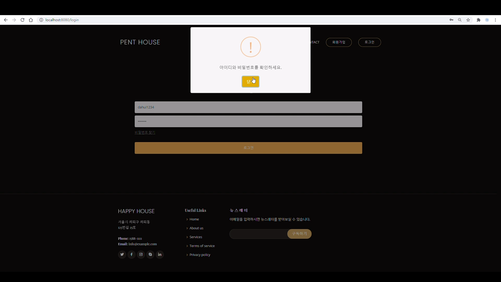

회원 정보 수정

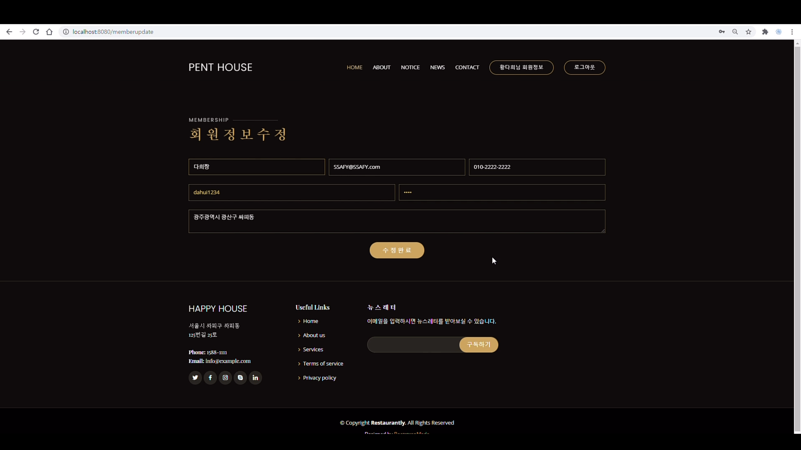

회원 탈퇴

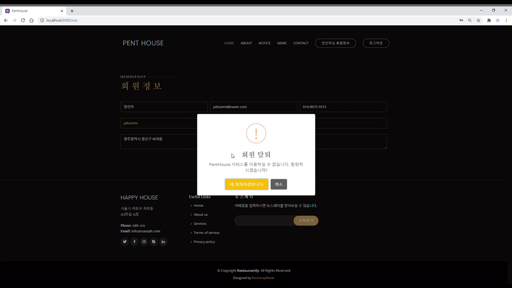

## Search
`2020년 06월` `봉천동` `아파트` `매매` 실거래 내역 검색

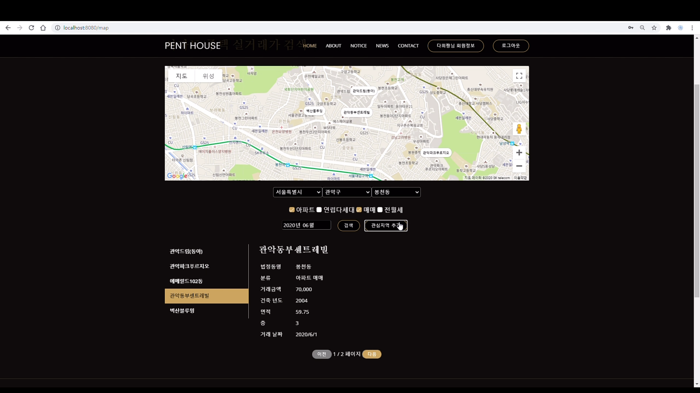

`관심지역` 등록을 통한 간편한 검색

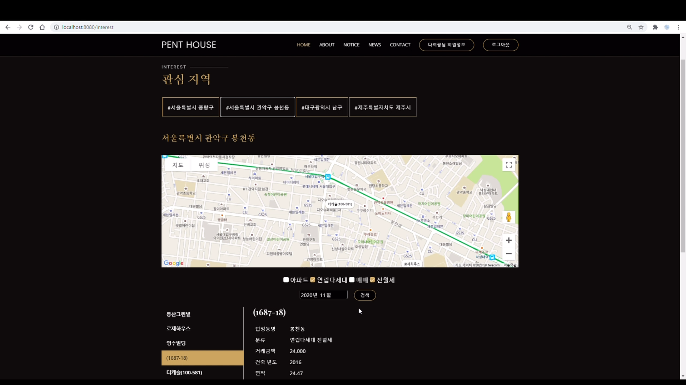

## Notice
메인 화면에서 공지사항 확인

공지사항 전체 보기 (페이징 처리)

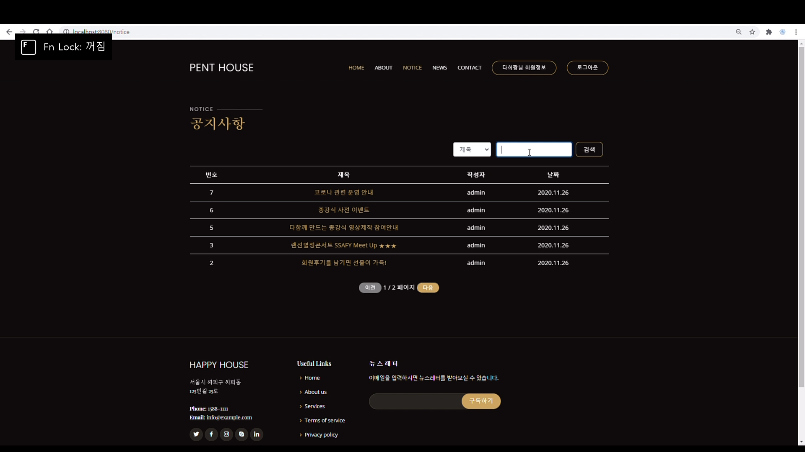

공지사항 `제목` 검색

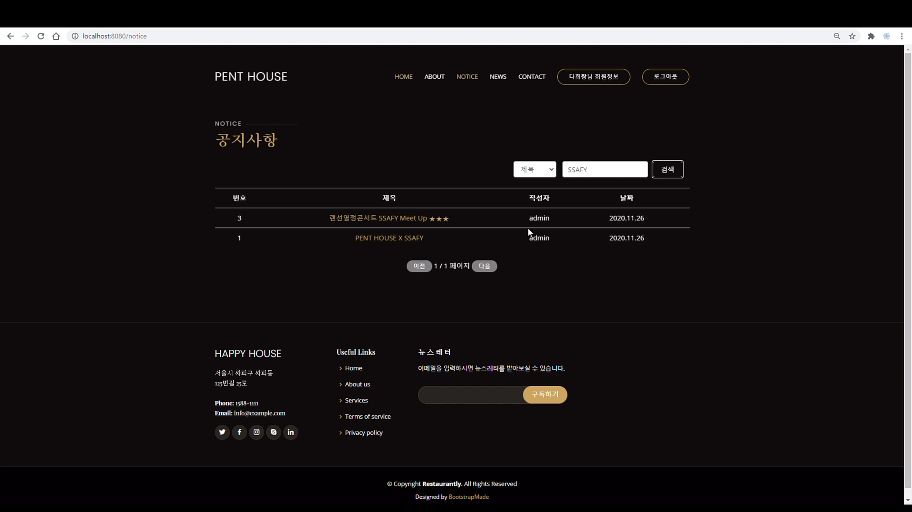

공지사항 상세보기

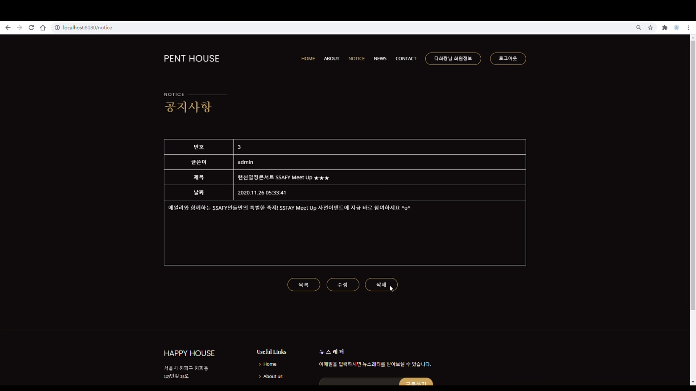

## News
메인 화면에서 오늘의 뉴스 확인

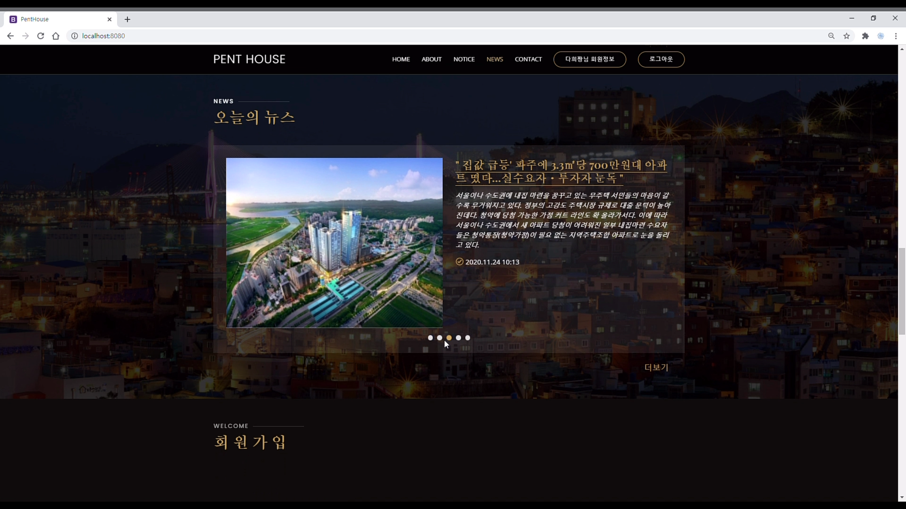

오늘의 뉴스 전체 보기

## Review
메인 화면에서 고객 후기 확인

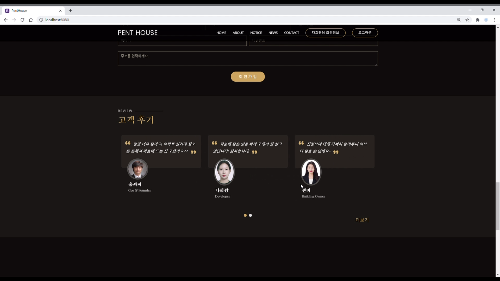

고객 후기 전체 보기

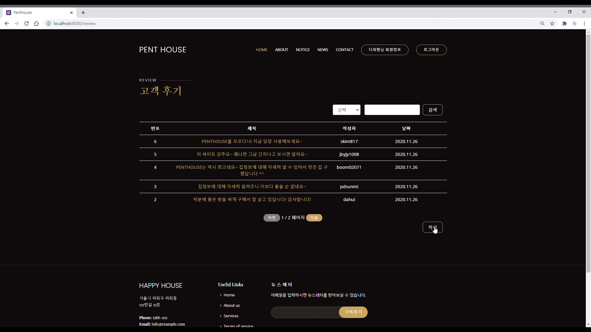
